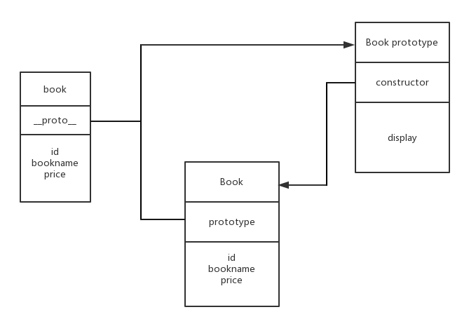

## 两种编程风格——面向过程与面向对象

在我们之前使用的方法中创建几个函数，这种方式叫做面向过程的实现方法，这种方式给页面增加了很多全局变量，而且不利于重复使用，一旦使用这些方法，就不能轻易去修改这些方法，现在我们需要的接受另一种编程风格——面向对象编程。

面向对象编程可不是真的坐在对象面前，面对着ta编程。

面向对象编程简单来说就是将我们的需求抽象成一个对象，然后针对这个对象分析其特征(属性)与动作(方法)，这个对象一般我们称作为“类”。

面向对象还有一个特点就是封装，就是把我们需要的功能放到一个对象里。就像我们要出去旅行，我们会把东西都放在一个行李箱中，然后携带方便，但是很遗憾的是`ES6`([ES6入门 阮一峰](http://es6.ruanyifeng.com/))之前`JavaScript`这种解释性的弱类型语言没有经典强类型语言中那种通过class等关键字实现的类的方法，但是可以通过一些特性模仿实现，这也是由于`JavaScript`有极高的灵活性，让我们编写代码更自由。

## 包装明星——封装

### 创建一个类
 
在`JavaScript`中创建一个类很容易，首先声明一个函数保存在一个变量中，按照编程习惯一般将这个代表类的变量名首字母大写。然后在这个类函数(类)的内部通过`this`(函数自带的一个变量，用于指向当前这个对象)来添加属性或者方法。

```
var Book = function(id, bookname, price) {
  this.id = id;
  this.bookname = bookname;
  this.price = price;
}
```

也可以通过在类的原型(类也是一个对象，所以也有原型`prototype`上添加属性和方法。

```
Book.prototype.display = function() {
  // 展示这本书
};
```
或者
```
Book.prototype = {
  display: function() {

  },
};
```
两种方式不能混用。

我们将需要的方法放进了`Book`类中，使用的时候先要`new`关键字实例化然后通过点语法访问。

那么通过`this`和通过`prototype`有什么区别呢？

通过`this`添加的的属性、方法实在当前对象上添加的，然而`JavaScript`是一种基于原型`prototype`的语言，所以每创建一个对象时(在`JavaScript`中函数也是对象)，他都有一个原型`prototype`用于指向其继承的属性、方法。通过`prototype`继承的方法并不是自身的，需要通过`prototype`一级一级查找来得到。这样就会发现通过`this`定义的属性或者方法是对象自身拥有的，所以通过类创建新对象时，`this`指向的属性和方法都会得到相应的创建，而通过`prototype`继承的属性和方法是通过`prototype`访问到，所以我们每次通过类创建一个新对象时这些属性和方法不会再次创建。




那么`constructor`又指的什么？

`constructor`是一个属性，当创建一个函数或者对象时都会为其创建一个原型对象`prototype`，在`prototype`对象又会像函数中创建`this`一样创建一个`constructor`属性，那么`constructor`属性指向的就是拥有整个原型对象的函数或对象。

### 这些都是我的——属性与方法封装

面向对象的一些特性在`JavaScript`中没有显性的存在，但是我们可以通过一些灵活的技巧来实现。

由于`JavaScript`的函数级作用域，声明在函数内部的变量以及方法在外界是访问不到的，通过这种特性即可创建类的**私有及私有方法**。

然而在函数内部通过`this`创建的属性和方法，在类创建对象时，每个对象自身都拥有一份，并且可以在外部访问到。因此通过`this`创建的属性可看作是**对象共有属性和对象共有方法**，而通过this创建的方法，不但可以访问这些对象的共有属性与共有方法，而且还能访问到类(创建时)或对象自身的私有属性和私有方法，由于这些方法权力比较大，所以我们将它看作为特权方法，在对象创建时可以通过这些特权方法初始化实例对象的一些属性，因此这些在创建对象时调用的特权方法还可以看作时类构造器。

```
// 私有属性与私有方法，特权方法，对象共有属性和对象共有方法，构造器
var Book = function(id, name, price) {
  // 私有属性
  var num = 1;
  // 私有方法
  function checkId() {
    // ...
  };

  // 特权方法
  this.getName = function() {};
  this.getPrice = function() {};
  this.setName = function() {};
  this.setPrice = function() {};

  // 对象共有属性
  this.id = id;
  // 对象共有方法
  this.copy = function() {};

  // 构造器
  this.setName(name);
  this.setPrice(price);

}
```

通过`JavaScript`函数级作用域的特征来实现在函数内部创建外界就访问不到的私有化方法。通过`new`关键字实例化对象时，由于对类执行一次，所以类的内部`this`上定义的属性和方法自然就可以复制到新创建的对象上，成为对象公有化的属性和方法，而其中的一些方法能访问到类的私有属性和方法。

通过`new`关键字实例化对象时，执行了一遍类的函数，所有里面通过调用特权方法自然就可以初始化对象的一些属性了。


可是在类的外部通过点语法定义的属性和方法以及在外部通过prototype定义的属性和方法又有什么作用呢？

通过`new`关键字创建新对象时，由于类外面通过点语法添加的属性和方法没有执行到，所以新创建的对象中无法获取他们，但是可以通过类来使用。因此在类外面通过点语法定义的属性以及方法被称为类的静态共有属性和类的静态共有方法。而通过`prototype`创建的属性或者方法在类实例的对象中可以通过`this`访问到的(新创建的对象的`__proto__`指向了类的原型所指向的对象)，所以我们将`prototype`对象中的属性和方法称为共有属性和共有方法，如：

```
// 类静态共有属性(对象不能访问)
Book.isChinese = true;
// 类静态共有方法(对象可以访问)
Book.resetTime = function() {
  console.log('new Time');
}
Book.prototype = {
  // 共有属性
  isJsBook: false,
  // 共有方法
  display: function() {

  }
}
```

通过`new`关键字创建的对象实质是对新对象`this`的不断赋值，并将`prototype`指向类的`prototype`所指向的对象，而类的构造函数外面通过点语法定义的属性方法是不会添加到新创建的对象上去的。因此要想在新创建的对象中使用`isChinese`就得通过`Book`类使用而不能通过`this`，如`Book.isChinese`，而通过`prototype`上定义的属性可以在新对象上直接使用，新对象的`prototype`和类的`prototype`指向的是同一个对象。

```
var b = new Book(11, 'JavaScript设计模式', 50);
console.log(b.num); // undefined
console.log(b.isJsBook);  // false
console.log(b.id);  // 11
console.log(b.isChinese); // undefined

console.log(Book.isChinese);  // true
Book.resetTime(); // new Time
```

### 你们看不到我——闭包实现

有时我们经常将类的静态变量通过闭包来实现。

```
// 利用闭包实现
var Book = (function() {
  // 静态私有变量
  var bookNum = 0;
  // 静态私有方法
  function checkBook(name) {

  }

  // 返回构造函数
  return function(newId, newName, newPrice) {
    // 私有变量
    var name, price;
    // 私有方法
    function checkId(id) {};

    // 特权方法
    this.getName = function() {};
    this.getPrice = function() {};
    this.setName = function() {};
    this.setPrice = function() {};

    // 共有属性
    this.id = newId;
    // 共有方法
    this.copy = function() {};
    bookNum++
    if(bookNum > 100) {
      throw new Error('仅出版100本书。');
    }

    // 构造器
    this.setName(name);
    this.setPrice(price);
  }
})();

Book.prototype = {
  // 静态公有属性
  isJSBook: false,
  // 静态公有方法
  display: function() {}
}
```

闭包就是有权访问另外一个函数作用域中变量的函数，即在一个函数内部创建另外一个函数。我们将这个闭包作为创建对象的构造函数，这样既是闭包又是可实例对象的函数，即可访问到类函数作用域中的变量，如`bookName`这个变量，此时这个变量叫静态私有变量，并且`checkBook()`可称之为静态私有方法。当然闭包内部内也有其自身的私有变量以及私有方法如`price、checkId()`。但是，在闭包外部添加原型属性和方法看上去像似脱离了闭包这个类，所以有时候在闭包内部实现一个完整的类然后返回。例如：

```
// 利用闭包实现
var Book = (function() {
  // 静态私有变量
  var bookNum = 0;
  // 静态私有方法
  function checkBook(name) {

  }

  // 创建类
  function _book(newId, newName, newPrice) {
    // 私有变量
    var name, price;
    // 私有方法
    function checkBook(name) {};
    // 特权方法
    this.getName = function() {};
    this.getPrice = function() {};
    this.setName = function() {};
    this.setPrice = function() {};
    // 共有属性
    this.id = newId;
    // 共有方法
    this.copy = function() {};
    bookNum++；
    if(bookNum > 100){
      throw new Error('仅出版100本书。');
    }
    // 构造器
    this.setName(name);
    this.setPrice(price);
  }
  
  // 构造原型
  _book.prototype = {
    // 静态公有属性
    isJSBook: false,
    // 静态公有方法
    display: function() {}
  }

  // 返回类
  return _book;
})();
```

这样看起来就更像一个主体。

### 找为检察长——创建对象的安全模式

对于新接触JavaScript创建对象由于不适应这种写法，所以经常容易忘记使用new而犯错。

我们可以实时监控来解决，那么就需要找位检察长，比如在JavaScript中创建对象时使用一种安全模式来解决。

```
// 图书类
var Book = function(title, time, type) {
  this.title = title;
  this.time = time;
  this.type = type;
}
// 实例化一本书
var book = Book('JavaScript', '2018', 'js');

console.log(book);  // undefined
console.log(window.title);  // JavaScript
console.log(window.time); // 2018
console.log(window.type); // js
```

出现这种情况是因为没有使用new关键字实例化。
new关键字的作用可以看作是对当前对象的this不停的赋值，然而例子中没有用new，所以就会直接执行这个函数，此时的this指向了全局变量window上面了，我们想要的结果是得到Book这个类(函数)的执行结果，由于函数中没有return语句，自然就回事undefined(未定义)。

那么我们就需要找位“检察长”了，使用安全模式。

```
var Book = function(title, time, type) {
  if(this instanceof Book){
    this.title = title;
    this.time = time;
    this.type = type;
  }else{
    return new Book(title, time, type);
  }
}

var book = Book('JavaScript', '2018', 'js');
```

```
console.log(book);  // Book
console.log(book.title);  // JavaScript
console.log(book.time); // 2018
console.log(book.type); // js

console.log(window.type); // undefined
console.log(window.time); // undefined
console.log(window.type); // undefined
```

## 传宗接代——继承


继承涉及的不仅仅是一个对象，比如人类的传宗接待。父母的一些特点传给孩子，但又不完全相同，总有自己的特点，所以父母和孩子是不同的个体。

但是JavaScript中没有继承这一现有的机制，我们可以通过一些方法实现。


说到继承([继承详解](https://www.cnblogs.com/humin/p/4556820.html))我们就需要一个父类，来让他们的子类来继承。

```
function SuperClass(value){
    // 属性
    this.superValue = value || 'SuperClass';
    this.books = ['JavaScript','HTML','CSS']
    // 方法
    this.fun = function(){
        console.log('父类的superValue值是' + this.superValue  );
    }
}
// 原型方式增加共有方法
SuperClass.prototype.getSuperValue = function(){
  return this.superValue;
}
```


### 子类的原型对象——原型链继承(类式继承)

因为JavaScript没有这些显性的限制才使得其具有了一定的灵活性，所以根据不同的需求实现多样式的继承。首先是类式继承。

```
// 声明子类
function SubClass() {
  this.subValue = "subValue";
}

// 继承父类
SubClass.prototype = new SuperClass();
SubClass.prototype.getSubValue = function(){
  return this.subValue;
}
```

上面可以看出，现在的子类subClass的原型prototype被赋予了第一个类的实例。

继承其实很简单：先声明2给类，然后一个类的实例赋值给另外一个类的原型。

类的原型对象的作用就是为类的原型添加共有方法，但类不能直接访问这些属性和方法，必须通过prototype来访问。我们实例化一个父类的时候，新创建的对象复制了父类的构造函数的属性和方法并将原型__proto__指向了父类的原型对象，这样新创建的对象不仅可以访问到父类原型上的属性和方法，同样可以访问到父类构造函数中复制的属性和方法。如果将这个对象赋值给子类的原型，那么这个子类的原型同样可以访问父类原型上的属性和方法。这就是类式继承(原型链)继承。

使用方法：
```
var instance = new SubClass();
console.log(instance.getSuperValue());  // SuperClass
console.log(instance.getSubValue());  // subValue
```

我们可以使用两张方法来检测某个对象是否是某个类的实例，或者说某个对象是否继承了某个类，这样来判断对象与类之间的继承关系。

  - instanceof   例如：instance instanceof SuperClass // true
  - isPrototypeOf()  例如：SuperClass.prototype.isPrototypeOf(instance) // true


```
console.log(instance instanceof SuperClass);  // true
console.log(instance instanceof SubClass);  // true
console.log(SubClass instanceof SuperClass);  // false
```

为什么SubClass instanceof SuperClass 得到的结果是false呢?

instanceof是判断前面对象是否是后面类(对象)的实例，它并不是表示两者是否继承。我们在实现SubClass继承SuperClass时是将SuperClass的实例赋值给SubClass的原型prototype，所以SubClass.prototype继承了SuperClass。

```
console.log(SubClass.prototype instanceof SuperClass);  // true
```

这正是类式(原型链)继承的特点：创建的所有对象都是Object的实例。

注意：通过原型链实现继承时，不能使用对象字面量创建原型方法。
```
SubClass.prototype = new SuperClass();
// 字面量添加方法 会导致上行代码无效
SubClass.prototype = {
  // ...b
}
```

类式(原型链)也是有缺点的：
  - 因为子类通过其原型prototype对父类实例化，继承了父类。所以说父类中的共有属性都要是引用类型，就会在子类中被所有实例公用，因此一个子类的实例更改子类原型从父类构造函数中继承来的共有属性就会直接影响到其他子类。
  ```
  var instance1 = new SubClass();
  var instance2 = new SubClass();
  console.log(instance2.books); // ['JavaScript','HTML','CSS']
  instance1.books.push('Node');
  console.log(instance2.books); // ['JavaScript','HTML','CSS','Node']
  ```
  - 由于子类实现的继承是靠prototype对父类实例化实现的，因此在创建父类的时候，是无法向父类传递参数的，因此在实例化父类的时候也无法对父类的构造函数内的属性进行初始化。
  

### 创建即继承——构造函数继承

在解决原型继承中包含引用类型值所带来问题过程中，我们可以使用另一种叫构造函数继承(有时也叫做伪造对象或经典继承)，毕竟JavaScript是灵活的。

```
function SubClass(value) {
  // 继承了SubClass
  SuperClass.call(this, value);
}

var instance1 = new SubClass('ECMAScript');
var instance2 = new SubClass('JavaScript');

console.log(instance1.superValue);  // ECMAScript
console.log(instance2.superValue);  // JavaScript
instance1.books.push('Node');
console.log(instance1.books); // ['JavaScript','HTML','CSS','Node']
console.log(instance2.books); // ['JavaScript','HTML','CSS']
console.log(instance1.getSuperValue()); // TypeError
console.log(instance1.fun()); // ECMAScript
```

`SuperClass.call(this, value);`是构造函数继承的精华。由于call这个方法可以更改函数的作用环境，因此在子类中，对SuperClass调用这个方法就是将子类中的变量在父类中执行一次，由于父类是给this绑定属性的，因此子类自然也就继承了父类的共有属性。由于这种类型的继承没有涉及原型prototype，所以父类的原型方法自然不会被子类继承，如果需要被继承就必须放到构造函数中，这样创建出来的每个实例都会单独拥有一份而不能共用，这样就违背了代码复用。


  